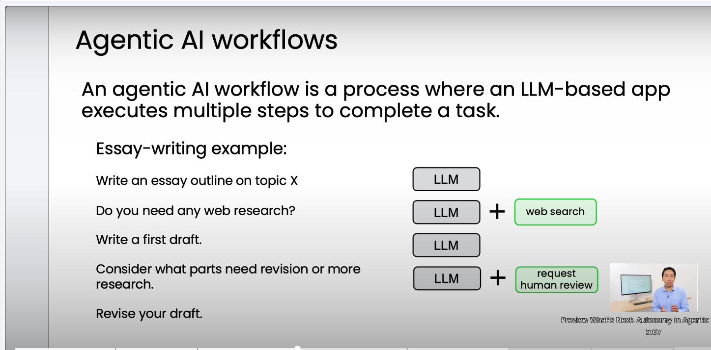
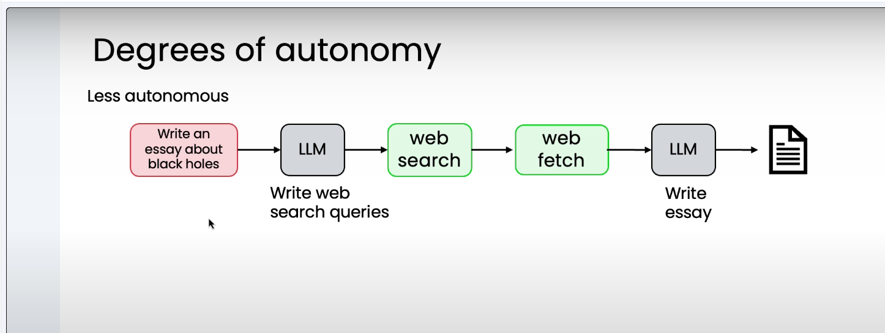
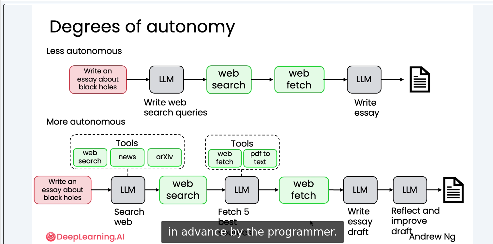
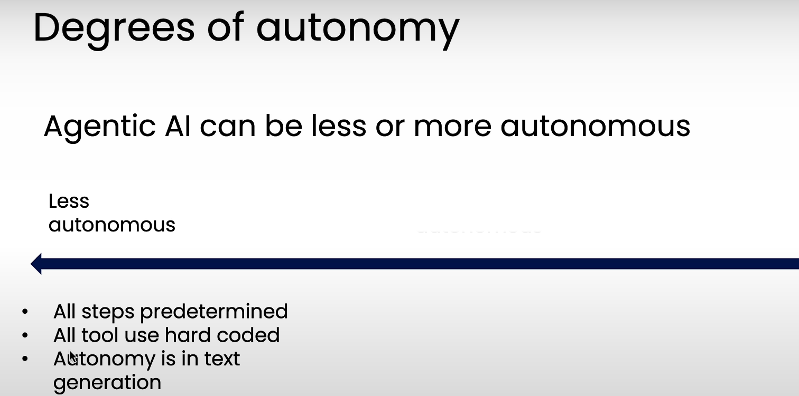
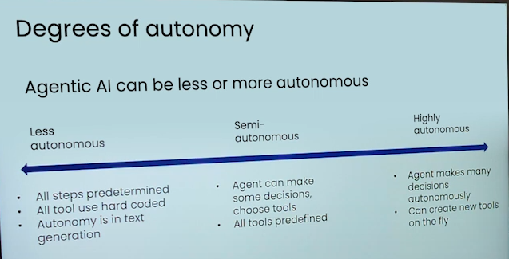
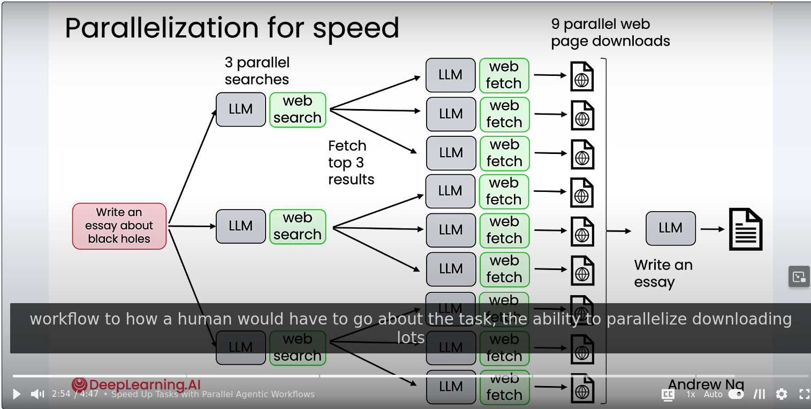
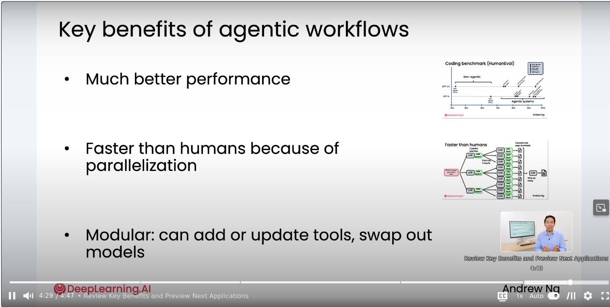
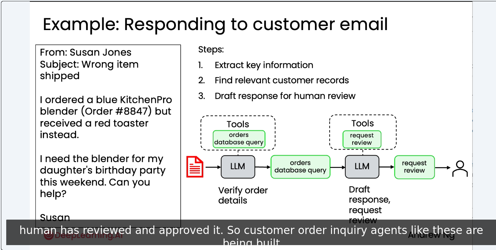
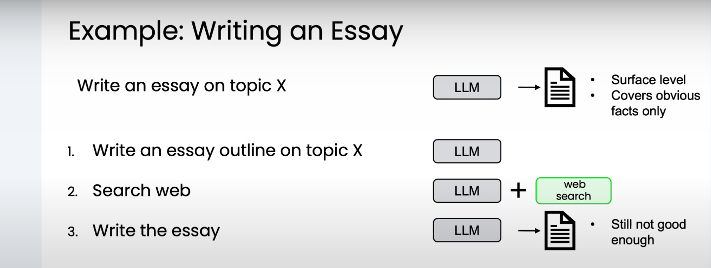
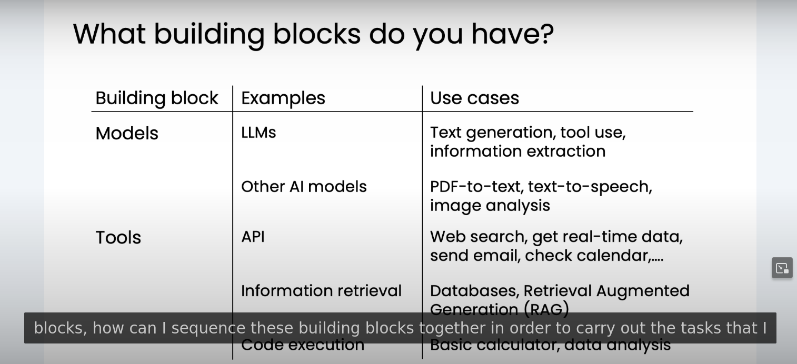

The differences I've seen between people that really know how to build agentic workflows compared to
people that are less effective at it is the ability to drive a disciplined development process,
specifically one focused on evals and error analysis.

# Agentic Workflows

One of the key skills
you learn in this course is how to take a complex task like writing an essay and breaking it down
into smaller steps for agentic workflows to execute one step at a time to then get the work output
that you want. And knowing how to decompose the task into steps and how to build the components
to execute the individual steps well turns out to be a tricky but important skill that will
determine your ability to build agentic workflows for a huge range of exciting applications

And so even for this example of a research agent, we can see that some agents can be
less autonomous, with a linear sequence of steps to be executed, determined by a programmer,
and some can be more autonomous, where you trust the LLM to make more decisions,
and the exact sequence of steps that happens may be even determined by the LLM, rather than
in advance by the programmer.

And this is a tool that lets an LLM write code and then run the code
on your computer to do a huge range of things. In case some of these tools seem a bit foreign to
you, don't worry about it. We'll go through the most important tools in much greater detail in
a later module. But I think of a lot of my work when I'm building an agent workflow as looking at
the work that the person or business is doing and then trying to figure out with these building
blocks, how can I sequence these building blocks together in order to carry out the tasks that I
want my system to carry out. And this is why having a good understanding of what building
blocks are available, which I hope you have a better sense of by the end of this course as well,
will allow you to better envision what agentic workflows you can build by combining these
building blocks together. So to summarize, one of the key skills in building agentic workflows is
to look at a bunch of stuff that maybe someone does and to identify the discrete steps that
it could be implemented with. And when I'm looking at the individual discrete steps,
one question I'm always asking myself is, can this step be implemented with either an
LLM or with one of the tools such as an API or a function call that I have access to?

